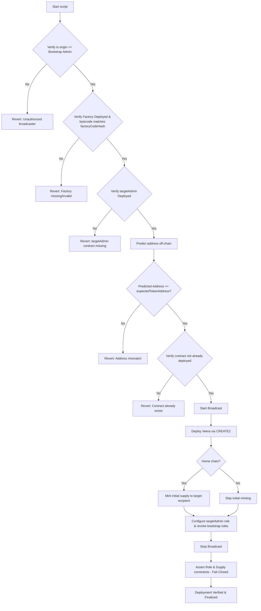

# Veera Token (`VEERA`)

This repository contains the smart contracts for the **Veera Token**, a standardized, secure, and deterministic ERC20 implementation with access control, capping, pause capability, and permit support. It is built using [Foundry](https://getfoundry.sh/) and [OpenZeppelin](https://www.openzeppelin.com/) standards.

The architecture is designed with **security** and **future interoperability** (cross-chain native bridging) in mind.

---

## 1. Architecture & Design Decisions

### Core Standards
* **ERC20:** Standard fungible token implementation.
* **ERC20Burnable:** Allows supply to be managed. This is **critical** for future cross-chain bridging (Lock-and-Mint / Burn-and-Mint).
* **ERC20Permit:** Enables gasless approvals (EIP-2612) for a seamless UX.
* **ERC20Pausable:** Emergency stop mechanism to freeze transfers in the event of a critical security incident. Note that pausing only affects transfers; minting and burning remain unaffected.
* **ERC20Capped:** Hard cap of 1 Billion tokens ($10^{27}$ wei) to prevent inflation.

### Access Control Strategy
We use OpenZeppelin `AccessControl` instead of `Ownable` to prevent "vendor lock-in" with bridge providers. This decoupling allows us to grant specific permissions to external protocols without surrendering admin control.

| Role | Intended Holder | Capabilities |
| :--- | :--- | :--- |
| **DEFAULT_ADMIN_ROLE** | **Gnosis Safe** | Can grant/revoke roles. The supreme authority. |
| **MINTER_ROLE** | **Bridge Adapter** | Granted to bridge contracts (like LayerZero OFT adapters) to handle minting when bridging. |
| **PAUSER_ROLE** | **Multisig / Guard** | Can pause/unpause all token transfers. |

---

## 2. Deterministic CREATE2 Deployment Workflow

To achieve identical contract addresses across multiple EVM chains (e.g., Base and BSC, mainnet and testnet) using `CREATE2`, the deployer factory, the deployment salt, and the creation bytecode (which includes constructor arguments) must be **completely invariant**.

### Deterministic Inputs

| Input Parameter | Value | Description |
| :--- | :--- | :--- |
| **CREATE2 Factory** | `0x4e59b44847b379578588920cA78FbF26c0B4956C` | Standard keyless Arachnid Deterministic Deployment Proxy. |
| **Salt** | `0xe2713982c0efe119dc5260cee9928c24af6cc4c4dcbc5f5bdb83a77932c80847` | Salt used to offset the deployment address. |
| **Token Name** | `"Veera Token"` | Constructor argument: Name of the ERC20 token. |
| **Token Symbol** | `"VEERA"` | Constructor argument: Symbol of the ERC20 token. |
| **Bootstrap Admin** | `0x3188aF25805b403006c49e9D387FB17bb65A9f25` | Constructor argument: Temporary global admin EOA. |
| **Constructor Supply** | `0` | Constructor argument: Must be strictly 0 on all chains. |
| **Max Supply** | `1_000_000_000` ($10^{27}$ wei) | Constructor argument: Total supply cap (1 Billion tokens). |

> [!NOTE]
> **Custom CREATE2 Factories:** While `0x4e59b44847b379578588920cA78FbF26c0B4956C` is the industry-standard Arachnid keyless CREATE2 factory, the JSON manifest allows specifying a custom factory address under the `"factory"` key, as well as its codehash under `"factoryCodeHash"`.

### Deterministic Target Address

When the above parameters are compiled with Solidity **0.8.24** (using Cancun EVM, optimization enabled at 200 runs), the resulting deterministic CREATE2 contract address is:

$$\mathbf{0x6e398a93eAcc13CBCb3e9a7c7a0B73821220E532}$$

---

## 3. Role of the Bootstrap Admin EOA

A common pitfall in EVM deployments is feeding `tx.origin` or `msg.sender` directly into the constructor to establish initial admin roles. Because the broadcasting wallet can differ between chains (or if different engineers run the scripts), this introduces variability in the constructor arguments, altering the initialization bytecode hash and resulting in different contract addresses.

To prevent this:
1. The **Bootstrap Admin EOA** (`0x3188aF25805b403006c49e9D387FB17bb65A9f25`) is hardcoded as the initial admin in the constructor arguments across all chains.
2. The deployment script **enforces** that the broadcaster of the deployment transaction matches this EOA.
3. At the end of the deployment transaction, the Bootstrap Admin EOA **grants the `DEFAULT_ADMIN_ROLE`** to the actual target address (`targetAdmin`) and **renounces/revokes all its own roles**.
4. Both **`PAUSER_ROLE` and `MINTER_ROLE` are left completely unassigned post-deployment** on all chains. The `targetAdmin` can grant these roles later (e.g. to a bridge adapter or emergency pause multisig).
5. Consequently, **the Bootstrap Admin retains 0 privileges** post-deployment.

---

## 4. Deployment Script Execution

The deployment is managed by `DeployVeera.s.sol`, which leverages `HelperConfig.s.sol` to parse `deploy_manifest.json` for chain-specific parameters.

### Step-by-Step Execution Flow



### Pre-Deployment Checklist

Before broadcasting, ensure the following are configured in `deploy_manifest.json` under the specific target chain ID:
- `targetAdmin`: Recipient of the default admin role. Must be a deployed Gnosis Safe contract address.
- `initialMintRecipient`: Recipient of the initial supply (home chain only).
- `expectedPostDeploymentSupply`: Total supply expected post-execution (1B on Base, 0 on BSC).

---

## 5. Operational Run Commands

### 1. Dry Run (Local Simulation)

Simulate the deployment locally on an Anvil fork or local node:

```bash
# Start anvil locally
anvil

# Run script simulation (will print predicted and expected addresses)
forge script script/DeployVeera.s.sol \
  --rpc-url http://localhost:8545 \
  --sender 0x3188aF25805b403006c49e9D387FB17bb65A9f25 \
  --unlocked
```

### 2. Mainnet / Testnet Deployment

To perform the live deployment on a network (e.g. Base Sepolia), configure your environment variables in `.env`:

```bash
DEPLOYER_ADDRESS=0x3188aF25805b403006c49e9D387FB17bb65A9f25
DEPLOYER_PRIVATE_KEY=0x... # (Or leave unset if signing interactively / using ledger)
```

Run the following command using the private key / hardware wallet of the Bootstrap Admin:

```bash
forge script script/DeployVeera.s.sol \
  --rpc-url <YOUR_RPC_URL> \
  --broadcast \
  --interactive \
  --sender 0x3188aF25805b403006c49e9D387FB17bb65A9f25 \
  --verify
```

---

## 6. Security, targetAdmin Validation, & Recovery

### Gnosis Safe validation
To prevent operational errors, the script validates that the `targetAdmin` is a **contract address** (i.e., Gnosis Safe or multisig vault) by performing an `extcodesize` check on live networks (bypassed on local anvil chain `31337`). If no code is deployed at `targetAdmin` on the target chain, the transaction will revert before broadcasting.

### Fail-Closed Assertions
The script executes post-deployment checks that will **revert the entire transaction** if any state violates the security criteria:
* If the total supply on a remote chain (like BSC) is non-zero, it reverts.
* If the bootstrap EOA retains `DEFAULT_ADMIN_ROLE`, `MINTER_ROLE`, or `PAUSER_ROLE`, it reverts.
* If the target admin does not have `DEFAULT_ADMIN_ROLE` assigned, it reverts.
* If the target admin (or any other address other than what's expected) has `PAUSER_ROLE` or `MINTER_ROLE` assigned post-deployment, it reverts.

### Interrupted Deployment Recovery
If a transaction fails or reverts midway, or if the factory is missing on a specific network, follow these recovery steps:
1. **Ensure Factory Existence:** If the Arachnid CREATE2 factory is not deployed on a new chain, deploy it keylessly using the transaction raw data from the official [Arachnid Proxy Repository](https://github.com/Arachnid/deterministic-deployment-proxy).
2. **Ensure targetAdmin Deployment:** Confirm that the Gnosis Safe or contract vault designated as `targetAdmin` has been deployed on the target chain.
3. **Review Gas & Nonces:** Ensure the Bootstrap Admin EOA has sufficient funds for gas on all networks and that no pending transactions are blocking the nonces.
4. **Verify Manifest Checksum:** Always inspect `deploy_manifest.json` to ensure the EIP-55 checksum of the target addresses matches the configuration.

---

## 7. Gas Considerations

The Veera token contract uses multiple OpenZeppelin extensions, which affects gas costs. Approximate gas costs for common operations:

| Operation | Estimated Gas | Notes |
| :--- | :--- | :--- |
| **Transfer** | ~51,000 | Standard ERC20 transfer with pause check |
| **Mint** | ~60,000 | Includes role check and cap validation |
| **Burn** | ~30,000 | Standard burn operation |
| **Approve** | ~46,000 | Standard ERC20 approval |
| **Permit** | ~80,000 | Gasless approval via EIP-2612 |
| **Pause/Unpause** | ~45,000 | Role-checked pause operation |

---

## 8. Contract Size Monitoring

Ethereum has a 24KB (24,576 bytes) contract size limit for runtime bytecode. Monitor the compiled contract size using:

```bash
forge build --sizes
```

---

## 9. Integration Testing

After deploying the contract, you can run comprehensive integration tests to verify all functionality on the deployed instance.

### Quick Start

1. **Navigate to integration tests directory:**
   ```bash
   cd integration-tests
   ```
2. **Install dependencies:**
   ```bash
   npm install
   ```
3. **Configure environment variables:**
   Add the following to your `.env` file (in the project root):
   ```bash
   # Required
   BASE_RPC_URL=https://sepolia.base.org
   CONTRACT_ADDRESS=0x...  # Your deployed contract address
   ADMIN_ADDRESS=0x...     # Admin address (has all roles)
   ADMIN_PRIVATE_KEY=0x... # Admin private key
   TEST_USER_ADDRESS=0x... # Test user address
   TEST_USER_PRIVATE_KEY=0x... # Test user private key
   ```
4. **Run tests:**
   ```bash
   npm test
   ```
