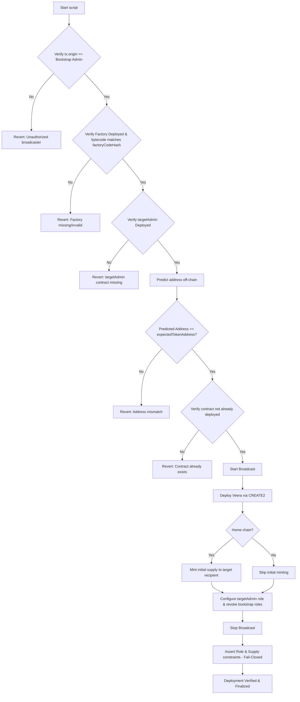

# Veera Token (`VEERA`)

This repository contains the smart contracts for the **Veera Token**, a standardized, secure, and deterministic ERC20 implementation with access control, capping, pause capability, and permit support. It is built using [Foundry](https://getfoundry.sh/) and [OpenZeppelin](https://www.openzeppelin.com/) standards.

The architecture is designed with **security** and **future interoperability** (cross-chain native bridging) in mind.

---

## 0. Deployments

The $VEERA token contract is currently deployed on:

* Base 
    * [Mainnet](https://basescan.org/address/0x6e398a93eAcc13CBCb3e9a7c7a0B73821220E532) 
    * [Testnet](https://sepolia.basescan.org/address/0x6e398a93eAcc13CBCb3e9a7c7a0B73821220E532)
* BSC 
    * [Mainnet](https://bscscan.com/address/0x6e398a93eAcc13CBCb3e9a7c7a0B73821220E532) 
    * [Testnet](https://testnet.bscscan.com/address/0x6e398a93eAcc13CBCb3e9a7c7a0B73821220E532)

## 1. Architecture & Design Decisions

### Core Standards
* **ERC20:** Standard fungible token implementation.
* **ERC20Burnable:** Allows supply to be managed. This is **critical** for future cross-chain bridging (Lock-and-Mint / Burn-and-Mint).
* **ERC20Permit:** Enables gasless approvals (EIP-2612) for a seamless UX.
* **ERC20Pausable:** Emergency stop mechanism to freeze transfers in the event of a critical security incident. Note that pausing only affects transfers; minting and burning remain unaffected.
* **ERC20Capped:** Hard cap of 1 Billion tokens ($10^{27}$ wei) to prevent inflation.

### Access Control Strategy
We use OpenZeppelin `AccessControl` instead of `Ownable` to prevent "vendor lock-in" with bridge providers. This decoupling allows us to grant specific permissions to external protocols without surrendering admin control.

| Role | Intended Holder | Capabilities |
| :--- | :--- | :--- |
| **DEFAULT_ADMIN_ROLE** | **Gnosis Safe** | Can grant/revoke roles. The supreme authority. |
| **MINTER_ROLE** | **Bridge Adapter** | Granted to bridge contracts (like LayerZero OFT adapters) to handle minting when bridging. |
| **PAUSER_ROLE** | **Multisig / Guard** | Can pause/unpause all token transfers. |

### LayerZero V2 Bridging (MintBurnOFTAdapter)

The cross-chain bridging is powered by LayerZero V2 using a custom [VeeraMintBurnOFTAdapter](src/bridge/VeeraMintBurnOFTAdapter.sol).

* **Mechanism**: Rather than locking tokens in an escrow vault (Lock-and-Unlock pattern), the adapter utilizes a **Burn-and-Mint** pattern. When a user sends tokens to another chain, the adapter burns them directly from the user's wallet via `burnFrom`. On the destination chain, the corresponding adapter mints them back to the user via `mint`. This maintains a clean, uniform global supply without custodial honeypots.
* **Access Control**: The adapter **must** receive `MINTER_ROLE` (and only this adapter) on the local [Veera](src/Veera.sol) token contract to allow it to mint tokens on credit (bridge in) without any other entity having mint authority.
* **User Approval**: Users **must approve** this adapter address on the `Veera` token contract before calling the LayerZero `send` function.
* **Peer Configuration**: It is recommended to use LayerZero's official `lz` CLI or Hardhat/devtools configuration tasks for peer wiring.
* **Operational Phases**:
  1. **Deployment**: Deploying the bridge adapter contract using `DeployOFTAdapter.s.sol`.
  2. **Configuration**: Wire the peers by calling `setPeer` on the adapter (using `ConfigureOFTAdapter.s.sol`).
  3. **Activation**: Granting `MINTER_ROLE` to the adapter address on the token contract (via Gnosis Safe).
  *Note: These are strictly separate lifecycle phases handled by distinct tasks/transactions.*
* **Deterministic Bridge Address Invariant**:
  The bridge adapter address will only match across chains when token address, LayerZero endpoint, targetAdmin, salt, factory, bytecode, and compiler settings all match. Since LayerZero endpoints are network-specific, predicted bridge adapter addresses will typically differ across mainnets and testnets depending on these variables.
* **Limitations & Safety Guidelines**:
  * **Single Adapter per Chain**: Only one `OFTAdapter` should be deployed per chain for this token. Multiple adapters break unified liquidity and can lead to permanent token loss on destination chains.
  * **Fee-on-Transfer**: Fee-on-transfer / rebasing tokens are **not supported** by this adapter.

---

## 2. Deterministic CREATE2 Deployment Workflow

To achieve identical contract addresses across multiple EVM chains (e.g., Base and BSC, mainnet and testnet) using `CREATE2`, the deployer factory, the deployment salt, and the creation bytecode (which includes constructor arguments) must be **completely invariant**.

### Deterministic Inputs

| Input Parameter | Value | Description |
| :--- | :--- | :--- |
| **CREATE2 Factory** | `0x4e59b44847b379578588920cA78FbF26c0B4956C` | Standard keyless Arachnid Deterministic Deployment Proxy. |
| **Salt** | `0xe2713982c0efe119dc5260cee9928c24af6cc4c4dcbc5f5bdb83a77932c80847` | Salt used to offset the deployment address. |
| **Token Name** | `"Veera Token"` | Constructor argument: Name of the ERC20 token. |
| **Token Symbol** | `"VEERA"` | Constructor argument: Symbol of the ERC20 token. |
| **Bootstrap Admin** | `0x3188aF25805b403006c49e9D387FB17bb65A9f25` | Constructor argument: Temporary global admin EOA. |
| **Constructor Supply** | `0` | Constructor argument: Must be strictly 0 on all chains. |
| **Max Supply** | `1_000_000_000` ($10^{27}$ wei) | Constructor argument: Total supply cap (1 Billion tokens). |

> [!NOTE]
> **Custom CREATE2 Factories:** While `0x4e59b44847b379578588920cA78FbF26c0B4956C` is the industry-standard Arachnid keyless CREATE2 factory, the JSON manifest allows specifying a custom factory address under the `"factory"` key, as well as its codehash under `"factoryCodeHash"`.

### Deterministic Target Address

When the above parameters are compiled with Solidity **0.8.28** (using Cancun EVM, optimization enabled at 200 runs), the resulting deterministic CREATE2 contract address is:

$$\mathbf{0x6e398a93eAcc13CBCb3e9a7c7a0B73821220E532}$$

---

## 3. Role of the Bootstrap Admin EOA

A common pitfall in EVM deployments is feeding `tx.origin` or `msg.sender` directly into the constructor to establish initial admin roles. Because the broadcasting wallet can differ between chains (or if different engineers run the scripts), this introduces variability in the constructor arguments, altering the initialization bytecode hash and resulting in different contract addresses.

To prevent this:
1. The **Bootstrap Admin EOA** (`0x3188aF25805b403006c49e9D387FB17bb65A9f25`) is hardcoded as the initial admin in the constructor arguments across all chains.
2. The deployment script **enforces** that the broadcaster of the deployment transaction matches this EOA.
3. At the end of the deployment transaction, the Bootstrap Admin EOA **grants the `DEFAULT_ADMIN_ROLE`** to the actual target address (`targetAdmin`) and **renounces/revokes all its own roles**.
4. Both **`PAUSER_ROLE` and `MINTER_ROLE` are left completely unassigned post-deployment** on all chains. The `targetAdmin` can grant these roles later (e.g. to a bridge adapter or emergency pause multisig).
5. Consequently, **the Bootstrap Admin retains 0 privileges** post-deployment.

---

## 4. Deployment Script Execution

The deployment is managed by `DeployVeera.s.sol`, which leverages `HelperConfig.s.sol` to parse the manifest specified by the `DEPLOY_MANIFEST_PATH` environment variable (e.g. `deploy_manifest.testnet.json` or `deploy_manifest.mainnet.json`) for chain-specific parameters.

### Step-by-Step Execution Flow



### Pre-Deployment Checklist

Before broadcasting, ensure the following are configured in the active deployment manifest under the specific target chain ID:
- `targetAdmin`: Recipient of the default admin role. Must be a deployed Gnosis Safe contract address.
- `initialMintRecipient`: Recipient of the initial supply (home chain only).
- `expectedPostDeploymentSupply`: Total supply expected post-execution (1B on Base, 0 on BSC).

### Production Deployment (Pre-compiled Artifacts)
For production deployments, it is recommended to use a pre-compiled bytecode artifact to ensure that local compiler versions or dependency changes do not affect the deployed bytecode.

1. Generate or locate the audited artifact (e.g., `verified-artifacts/Veera.json`).
2. Deploy using the `ARTIFACT_PATH` environment variable:
```bash
ARTIFACT_PATH="verified-artifacts/Veera.json" ./scripts/deploy.sh
```
The script will load the bytecode from the JSON file and append the constructor arguments defined in `deploy_manifest.json` dynamically.

---
## 5. Deployment Management & Security Lifecycle

### Manifest File Maintenance
The JSON configuration files `deploy_manifest.mainnet.json` and `deploy_manifest.testnet.json` act as the single source of truth for deployments. Proposing modifications to any global parameters (like `salt` or `bootstrapAdmin`) or changing network configurations must be done with caution.

To guarantee manifest integrity and prevent unauthorized changes, the codebase implements two verification steps:
1. **Solidity Code Integrity Hash:** The script `DeployVeera.s.sol` calculates the `keccak256` hash of the parsed global deterministic parameters and asserts that it matches `EXPECTED_MANIFEST_INTEGRITY_HASH`. Proposing a global parameter manifest change requires updating this code hash in `DeployVeera.s.sol`.
2. **SHA-256 Checksum Validation:** The utility script [verify-manifest-checksum.sh](scripts/verify-manifest-checksum.sh) computes the SHA-256 hash of `deploy_manifest.mainnet.json` and compares it against the approved checksum defined directly in the script.

> [!IMPORTANT]
> **Updating the Checksum Script:**
> When the mainnet manifest `deploy_manifest.mainnet.json` is intentionally changed, the checksum validation will fail. To update the approved checksum:
> 1. Run the verification script:
>    ```bash
>    ./scripts/verify-manifest-checksum.sh
>    ```
>    This will compute and display the updated checksum.
> 2. Copy the new checksum from the terminal output.
> 3. Open [verify-manifest-checksum.sh](scripts/verify-manifest-checksum.sh) and update the `APPROVED_CHECKSUM` variable with the copied value.
> 4. Re-run `./scripts/verify-manifest-checksum.sh` to ensure the check passes.


### Predicted Addresses Per Chain
With optimization enabled (Solidity 0.8.28, Cancun, 200 runs) and the standard Arachnid CREATE2 factory, the predicted token address is:
* **All Networks (Base & BSC Mainnet/Testnet):** `0x6e398a93eAcc13CBCb3e9a7c7a0B73821220E532`
* **Local Anvil (Chain ID 31337):** Matches the above address if the default parameters are used, but can be set to `address(0)` in the manifest for local development/testing.

### Bootstrap Process & Security Assumptions
1. **Signer Ownership:** The Bootstrap Admin EOA (`0x3188aF25805b403006c49e9D387FB17bb65A9f25`) acts as a temporary bootstrap owner. It must sign the deployment script.
2. **Zero-Trust Transfer:** In the same deployment flow, all initial roles are transferred to the Gnosis Safe multisig `targetAdmin` contract, and the Bootstrap Admin renounces all its roles. Post-deployment, the Bootstrap Admin holds zero roles or privileges.
3. **Pausable and Minter Invariance:** `PAUSER_ROLE` and `MINTER_ROLE` are intentionally left unassigned post-deployment. The Gnosis Safe `targetAdmin` is the only entity that can grant these roles subsequently.

### Post-Deployment Verification Steps
After running the script, verify the deployed contract state:
1. **Run Checksum Verification:** Use `./scripts/verify-manifest-checksum.sh` to ensure the manifest was not modified during the deployment.
2. **Run Post-Deployment Script:** Execute `scripts/verify-deployment.sh` against the deployed token address:
   ```bash
   ./scripts/verify-deployment.sh 0x6e398a93eAcc13CBCb3e9a7c7a0B73821220E532 <EXPECTED_TARGET_ADMIN_ADDRESS>
   ```
   This script performs on-chain queries to verify the metadata, supply, role setup, and checks that the bootstrap EOA has no roles left.

---

## 6. Operational Run Commands

### 1. Dry Run (Local Simulation)
Simulate the deployment locally on an Anvil fork or local node. You can also specify the `DRY_RUN=true` environment variable to simulate address prediction and parsing logic without triggering any transaction broadcast:
```bash
# Start anvil locally
anvil

# Run script simulation
forge script script/DeployVeera.s.sol \
  --rpc-url http://localhost:8545 \
  --sender 0x3188aF25805b403006c49e9D387FB17bb65A9f25 \
  --unlocked
```

### 2. Mainnet / Testnet Deployment
To perform the live deployment on a network (e.g. Base Sepolia), configure your environment variables in `.env`:
```bash
DEPLOYER_ADDRESS=0x3188aF25805b403006c49e9D387FB17bb65A9f25
DEPLOYER_PRIVATE_KEY=0x... # (Or leave unset if signing interactively / using ledger)
```
Run the following command using the private key / hardware wallet of the Bootstrap Admin:
```bash
forge script script/DeployVeera.s.sol \
  --rpc-url <YOUR_RPC_URL> \
  --broadcast \
  --interactive \
  --sender 0x3188aF25805b403006c49e9D387FB17bb65A9f25 \
  --verify
```

---

## 7. Security, targetAdmin Validation, & Recovery

### Gnosis Safe validation
To prevent operational errors, the script validates that the `targetAdmin` is a **contract address** (i.e., Gnosis Safe or multisig vault) by performing an `extcodesize` check on live networks (bypassed on local anvil chain `31337`). If no code is deployed at `targetAdmin` on the target chain, the transaction will revert before broadcasting.

### Fail-Closed Assertions & Verification
Because the script performs multiple separate broadcasted calls (deployment, minting, role setups), a failure in the final verification step does not automatically roll back prior completed transactions on-chain. However, the script executes post-deployment checks at the end of its run to ensure the final state strictly matches all security criteria:
* If the total supply on a remote chain (like BSC) is non-zero, the script fails.
* If the bootstrap EOA retains `DEFAULT_ADMIN_ROLE`, `MINTER_ROLE`, or `PAUSER_ROLE`, the script fails.
* If the target admin does not have `DEFAULT_ADMIN_ROLE` assigned, the script fails.
* If the target admin (or any other address other than what's expected) has `PAUSER_ROLE` or `MINTER_ROLE` assigned post-deployment, the script fails.

The practical guarantee is that if any check fails, the script fails verification and prevents a successful deployment run from being accepted or recorded as valid.

### Interrupted Deployment Recovery
If a transaction fails or reverts midway, or if the factory is missing on a specific network, follow these recovery steps:
1. **Ensure Factory Existence:** If the Arachnid CREATE2 factory is not deployed on a new chain, deploy it keylessly using the transaction raw data from the official [Arachnid Proxy Repository](https://github.com/Arachnid/deterministic-deployment-proxy).
2. **Ensure targetAdmin Deployment:** Confirm that the Gnosis Safe or contract vault designated as `targetAdmin` has been deployed on the target chain.
3. **Review Gas & Nonces:** Ensure the Bootstrap Admin EOA has sufficient funds for gas on all networks and that no pending transactions are blocking the nonces.
4. **Verify Manifest Checksum:** Always inspect `deploy_manifest.json` to ensure the EIP-55 checksum of the target addresses matches the configuration.

---

## 8. Gas Considerations

The Veera token contract uses multiple OpenZeppelin extensions, which affects gas costs. Approximate gas costs for common operations:

| Operation | Estimated Gas | Notes |
| :--- | :--- | :--- |
| **Transfer** | ~51,000 | Standard ERC20 transfer with pause check |
| **Mint** | ~60,000 | Includes role check and cap validation |
| **Burn** | ~30,000 | Standard burn operation |
| **Approve** | ~46,000 | Standard ERC20 approval |
| **Permit** | ~80,000 | Gasless approval via EIP-2612 |
| **Pause/Unpause** | ~45,000 | Role-checked pause operation |

---

## 9. Contract Size Monitoring

Ethereum has a 24KB (24,576 bytes) contract size limit for runtime bytecode. Monitor the compiled contract size using:

```bash
forge build --sizes
```

---

## 10. Integration Testing

After deploying the contract, you can run comprehensive integration tests to verify all functionality on the deployed instance.

### Quick Start

1. **Navigate to integration tests directory:**
   ```bash
   cd integration-tests
   ```
2. **Install dependencies:**
   ```bash
   npm install
   ```
3. **Configure environment variables:**
   Add the following to your `.env` file (in the project root):
   ```bash
   # Required
   BASE_RPC_URL=https://sepolia.base.org
   CONTRACT_ADDRESS=0x...  # Your deployed contract address
   ADMIN_ADDRESS=0x...     # Admin address (has all roles)
   ADMIN_PRIVATE_KEY=0x... # Admin private key
   TEST_USER_ADDRESS=0x... # Test user address
   TEST_USER_PRIVATE_KEY=0x... # Test user private key
   ```
4. **Run tests:**
   ```bash
   npm test
   ```

### 10.1 Live Integration Test Evidence (Base Sepolia ↔ BSC Testnet)
Verification evidence from executing the cross-chain integration tests:

* **Initial States**:
  * **Base Sepolia**: 999,999,898 VEERA
  * **BSC Testnet**: 2 VEERA

* **Cycle 1 (Base Sepolia ➔ BSC Testnet)**:
  * **Bridged Amount**: 1 VEERA
  * **LayerZero Native Fee**: 0.000221488614313199 ETH
  * **Transaction Hash**: [0xefdee8586c6f73604c0485e2ad9d7e635a6069e2d4347e0e599621383e338599](https://testnet.layerzeroscan.com/tx/0xefdee8586c6f73604c0485e2ad9d7e635a6069e2d4347e0e599621383e338599)
  * **Post-delivery BSC Testnet Balance**: 3 VEERA

* **Cycle 2 (BSC Testnet ➔ Base Sepolia)**:
  * **Bridged Amount**: 1 VEERA
  * **LayerZero Native Fee**: 0.000347596069246719 BNB
  * **Transaction Hash**: [0xac72620bf2e2e54e38e6d56abc7b4c2ce5f1f581c2f95f0232838353357d2bcb](https://testnet.layerzeroscan.com/tx/0xac72620bf2e2e54e38e6d56abc7b4c2ce5f1f581c2f95f0232838353357d2bcb)
  * **Post-delivery Base Sepolia Balance**: 999,999,898 VEERA


---

## 11. LayerZero Pathway Configuration & Wiring (Hardhat Suite)

While Foundry is used for compiling, testing, and deterministic CREATE2 contract deployments, LayerZero V2 configurations (such as peer wiring, pathway verification, send/receive library settings, enforced option parameters, and DVN settings) are managed via Hardhat using LayerZero’s official devtools (`@layerzerolabs/toolbox-hardhat`).

### 11.1 Single Source of Truth Address Invariant
To prevent configuration drift, all contract addresses are resolved dynamically on-the-fly from the deployment manifest specified by the `DEPLOY_MANIFEST_PATH` environment variable (e.g. [deploy_manifest.mainnet.json](deploy_manifest.mainnet.json)). We **never** hardcode deployed contract addresses across different configuration files.

### 11.2 Operational Scripts
The root `package.json` contains pre-configured scripts for pathway wiring and diagnostics.

| Action | Testnet (Base Sepolia ↔ BSC Testnet) | Mainnet (Base ↔ BSC) |
| :--- | :--- | :--- |
| **Configure Wiring & Peers** | `npm run lz:wire:testnet` | `npm run lz:wire:mainnet` |
| **Read Back Peers** | `npm run lz:peers:testnet` | `npm run lz:peers:mainnet` |
| **Read Back Config & DVNs** | `npm run lz:config:testnet` | `npm run lz:config:mainnet` |

### 11.3 Gnosis Safe Multisig Wiring Workflow
Because the `VeeraMintBurnOFTAdapter` contracts on Mainnet are owned by the Gnosis Safe multisig `targetAdmin` contract, wiring configuration transactions cannot be signed by a standard EOA private key. 

To wire pathways for Gnosis Safe-owned contracts:
1. Ensure your `.env` does not contain a `LZ_CONFIG_PRIVATE_KEY` (or leave it unset/empty).
2. Execute the wiring task. The LayerZero toolchain will automatically detect that no private key is present to sign, perform checks on-chain, and generate/propose the raw transaction payloads (calldata).
3. Copy the proposed calldata, target addresses, and value fields from the terminal.
4. Open the Gnosis Safe dashboard on the respective chain.
5. Launch the **Transaction Builder** app.
6. Input the target contract address, paste the generated calldata, and enqueue the transaction.
7. Repeat for all enqueued pathways, and sign/execute the transactions with the Safe owners.

### 11.4 Post-Wiring Verification & Diagnostics
Before authorizing a bridge to mint/burn tokens, you **must** perform a configuration check:
1. Run the wiring task on the selected network.
2. Query the actual configured peers using:
   ```bash
   npm run lz:peers:testnet
   ```
3. Query and export the pathway configurations, verifying dvns and confirmations:
   ```bash
   npm run lz:config:testnet
   ```
4. Verify that the output lists the correct expected peers and connection statuses.

### 11.5 Mainnet Security and DVN Policy
* **Testnet Policy:** A single DVN configuration (using the default `LayerZero Labs` DVN) is acceptable for initial integration testing.
* **Mainnet Policy:** A single-DVN configuration poses a central point of compromise. For mainnet production deployments:
  - Configure **multiple required DVNs** (e.g., Google Cloud DVN, Nethermind DVN, LayerZero Labs DVN) via `lzRequiredDVNs` in the network configuration block of the active manifest (e.g. [deploy_manifest.mainnet.json](deploy_manifest.mainnet.json)).
  - Alternatively, configure a required/optional threshold setup.
  - Do not enable production bridge use (e.g., granting `MINTER_ROLE` to the bridge adapter on the token contract) until the multi-DVN config is successfully wired and read back matching the approved security policy.

